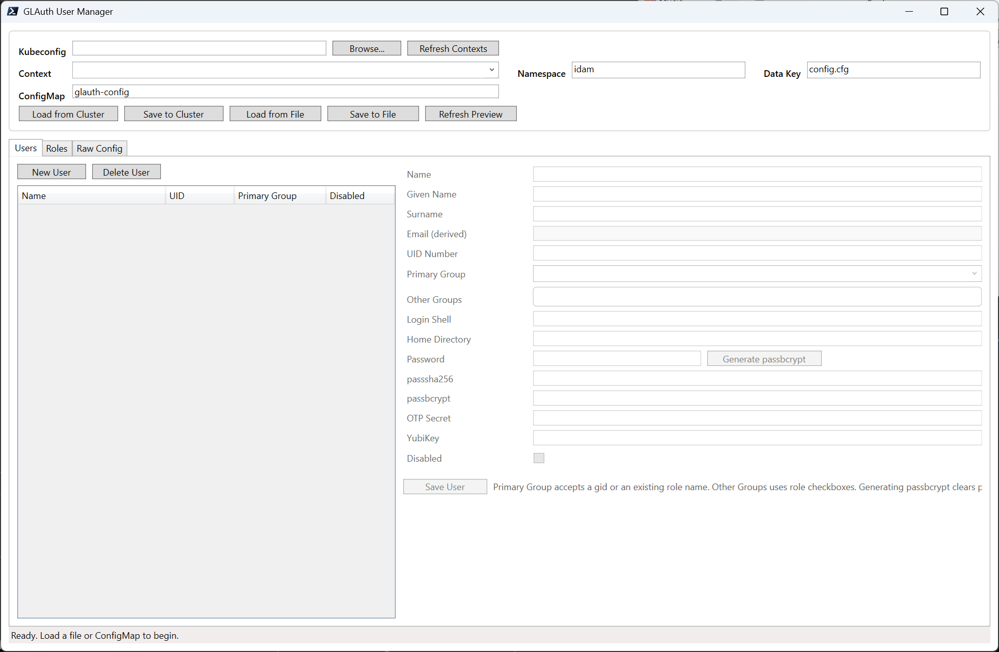

# GLAuth User Manager

 PowerShell + WPF desktop app for editing `[[users]]` and `[[groups]]` in a GLAuth file-backed config, with ConfigMap load/save support for Kubernetes.

Current version: **0.0.1**



## Features

- Load GLAuth config from a local file or from `kubectl get configmap`
- Pick a kubeconfig file and choose a context from a dropdown populated by `kubectl config get-contexts`
- Edit, create, and delete users
- Generate GLAuth-compatible `passbcrypt` values from a password inside the GUI
- Derive every user email as `name@domain` from `backend.baseDN`
- Edit, create, and delete roles/groups
- Preview the generated config before saving
- Save back to Kubernetes with `kubectl replace -f`, reusing the loaded ConfigMap object so the update keeps normal metadata and honors `resourceVersion`

## Run

```powershell
pwsh -ExecutionPolicy Bypass -File .\Launch-GlauthUserManager.ps1
```

PowerShell 7+ is required.

## Release

Push a tag matching the `VERSION` file to create a GitHub release package with Actions.

```powershell
git tag v0.0.1
git push origin v0.0.1
```

## Kubernetes workflow

1. Select a kubeconfig file, refresh contexts if needed, and choose the target context.
2. Use **Load from Cluster** to pull the current config with `kubectl get configmap ... -o json`.
3. Edit users and roles.
4. Use **Save to Cluster** to push the updated ConfigMap with `kubectl replace -f`.

`kubectl replace` is used instead of a simple patch so the app performs a safer read/modify/write update against the ConfigMap version that was loaded.

## Notes

- The editor is centered on standard GLAuth user/group fields and preserves non-user/group sections of the file.
- The email field is read-only and is derived from the username plus the `backend.baseDN` domain (for example `dc=example,dc=org` becomes `example.org`).
- Advanced nested blocks already present under a user or group, such as capabilities blocks, are carried through when saving.
- Generated `passbcrypt` values are hex-encoded from the full bcrypt string and use cost `10`, matching the usual `htpasswd -bnBC 10 ... | xxd -p` workflow.
- The resulting decoded bcrypt prefix is `$2a$10$`, which matches GLAuth's own sample hashes even though some docs/comments refer to `$2y$`.
- Third-party license notices for bundled dependencies are included in `THIRD-PARTY-NOTICES.txt`.
